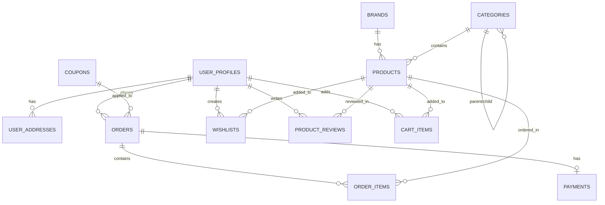

# 🛢️ 에끌라린 데이터베이스 테이블 구조 정리

> **목적**: TOSS PG 인증 및 향후 ADMIN 페이지 개발을 위한 완전한 DB 구조 정리
> **최종 업데이트**: 2024년 12월

## 📋 테이블 개요

총 **12개 핵심 테이블**로 구성된 완전한 쇼핑몰 데이터베이스

| 테이블명          | 설명                | 관계                          | 우선순위   |
| ----------------- | ------------------- | ----------------------------- | ---------- |
| `brands`          | 브랜드 정보         | 1:N → products                | ⭐⭐⭐     |
| `categories`      | 카테고리 (계층구조) | 1:N → products                | ⭐⭐⭐     |
| `products`        | 상품 정보 (핵심)    | N:1 → brands, categories      | ⭐⭐⭐⭐⭐ |
| `user_profiles`   | 사용자 프로필       | 1:1 → auth.users              | ⭐⭐⭐⭐   |
| `user_addresses`  | 사용자 주소         | N:1 → user_profiles           | ⭐⭐⭐     |
| `orders`          | 주문 정보           | N:1 → user_profiles           | ⭐⭐⭐⭐⭐ |
| `order_items`     | 주문 상품 상세      | N:1 → orders, products        | ⭐⭐⭐⭐⭐ |
| `payments`        | 결제 정보           | 1:1 → orders                  | ⭐⭐⭐⭐   |
| `coupons`         | 쿠폰 정보           | 1:N → orders                  | ⭐⭐⭐     |
| `wishlists`       | 위시리스트          | N:1 → user_profiles, products | ⭐⭐       |
| `product_reviews` | 상품 리뷰           | N:1 → products, user_profiles | ⭐⭐⭐     |
| `cart_items`      | 장바구니 아이템     | N:1 → user_profiles, products | ⭐⭐       |

---

## 🏷️ 1. BRANDS 테이블

**목적**: 브랜드 정보 관리 (에끌라린, Silver Moon, Golden Craft 등)

```sql
CREATE TABLE brands (
  id BIGSERIAL PRIMARY KEY,
  name VARCHAR(255) NOT NULL,                    -- 브랜드명
  slug VARCHAR(255) UNIQUE NOT NULL,             -- URL 슬러그
  description TEXT,                              -- 브랜드 설명
  logo_url TEXT,                                 -- 로고 이미지 URL
  website_url TEXT,                              -- 브랜드 웹사이트
  is_featured BOOLEAN DEFAULT false,             -- 추천 브랜드 여부
  is_active BOOLEAN DEFAULT true,                -- 활성화 여부
  created_at TIMESTAMP WITH TIME ZONE DEFAULT NOW(),
  updated_at TIMESTAMP WITH TIME ZONE DEFAULT NOW()
);
```

### 📊 실제 사용 데이터 구조

```javascript
// src/data/accessory-data.js 참조
{
  id: 1,
  name: "ECLARINE",
  slug: "eclarine",
  description: "에끌라린 자체 브랜드",
  logo: "/assets/img/brand/eclarine-logo.png",
  is_featured: true
}
```

---

## 📂 2. CATEGORIES 테이블

**목적**: 상품 카테고리 관리 (계층구조 지원)

```sql
CREATE TABLE categories (
  id BIGSERIAL PRIMARY KEY,
  name VARCHAR(255) NOT NULL,                    -- 카테고리명
  slug VARCHAR(255) UNIQUE NOT NULL,             -- URL 슬러그
  description TEXT,                              -- 카테고리 설명
  image_url TEXT,                                -- 카테고리 이미지
  icon_class VARCHAR(100),                       -- FontAwesome 아이콘
  parent_id BIGINT REFERENCES categories(id),    -- 부모 카테고리 (계층구조)
  sort_order INTEGER DEFAULT 0,                  -- 정렬 순서
  is_active BOOLEAN DEFAULT true,                -- 활성화 여부
  meta_title VARCHAR(255),                       -- SEO 메타 제목
  meta_description TEXT,                         -- SEO 메타 설명
  created_at TIMESTAMP WITH TIME ZONE DEFAULT NOW(),
  updated_at TIMESTAMP WITH TIME ZONE DEFAULT NOW()
);
```

### 📊 실제 사용 데이터 구조

```javascript
// 악세서리 전문 카테고리
{
  id: 1,
  name: "실버 (Silver)",
  slug: "silver",
  description: "925 실버 소재의 고급 악세서리",
  image: "/assets/img/category/silver.jpg",
  icon: "fas fa-star",
  color: "#C0C0C0",
  is_featured: true
}
```

---

## 🛍️ 3. PRODUCTS 테이블 (핵심)

**목적**: 상품 정보 관리 (가장 중요한 테이블)

```sql
CREATE TABLE products (
  id BIGSERIAL PRIMARY KEY,
  title VARCHAR(255) NOT NULL,                   -- 상품명
  slug VARCHAR(255) UNIQUE NOT NULL,             -- URL 슬러그
  description TEXT,                              -- 상품 상세 설명
  short_description TEXT,                        -- 상품 간단 설명
  sku VARCHAR(100) UNIQUE,                       -- 상품 고유 코드

  -- 💰 가격 정보
  price DECIMAL(10,2) NOT NULL,                  -- 판매가 (원화)
  compare_price DECIMAL(10,2),                   -- 정가 (할인 전 가격)
  cost_price DECIMAL(10,2),                      -- 원가 (관리자용)

  -- 📦 재고 관리
  track_quantity BOOLEAN DEFAULT true,           -- 재고 추적 여부
  quantity INTEGER DEFAULT 0,                    -- 현재 재고
  low_stock_threshold INTEGER DEFAULT 5,         -- 재고 부족 기준

  -- 📏 물리적 속성
  weight DECIMAL(8,2),                           -- 무게 (g)

  -- 🏷️ 상품 메타데이터
  type VARCHAR(50) DEFAULT 'simple',             -- 상품 타입 (simple, variable)
  status VARCHAR(20) DEFAULT 'active',           -- 상태 (active, inactive, draft)
  visibility VARCHAR(20) DEFAULT 'public',       -- 공개 설정 (public, private)

  -- 📷 이미지 및 미디어
  featured_image TEXT,                           -- 대표 이미지
  gallery_images JSONB DEFAULT '[]',             -- 갤러리 이미지 배열

  -- 🔍 SEO
  meta_title VARCHAR(255),                       -- SEO 메타 제목
  meta_description TEXT,                         -- SEO 메타 설명

  -- 🌟 특별 플래그들
  is_featured BOOLEAN DEFAULT false,             -- 추천 상품
  is_popular BOOLEAN DEFAULT false,              -- 인기 상품
  is_bestseller BOOLEAN DEFAULT false,           -- 베스트셀러
  is_digital BOOLEAN DEFAULT false,              -- 디지털 상품

  -- 🔗 관계
  category_id BIGINT REFERENCES categories(id),  -- 카테고리 FK
  brand_id BIGINT REFERENCES brands(id),         -- 브랜드 FK

  -- ⭐ 평점 (캐시용)
  average_rating DECIMAL(3,2) DEFAULT 0,        -- 평균 평점
  review_count INTEGER DEFAULT 0,               -- 리뷰 개수

  -- 📊 판매 통계 (캐시용)
  sales_count INTEGER DEFAULT 0,                -- 판매 개수
  view_count INTEGER DEFAULT 0,                 -- 조회 수

  -- 🔧 추가 속성 (JSON)
  attributes JSONB DEFAULT '{}',                -- 상품 속성 (소재, 크기 등)
  variations JSONB DEFAULT '[]',                -- 상품 옵션 (색상, 사이즈 등)

  created_at TIMESTAMP WITH TIME ZONE DEFAULT NOW(),
  updated_at TIMESTAMP WITH TIME ZONE DEFAULT NOW()
);
```

### 📊 실제 사용 데이터 구조

```javascript
// src/data/accessory-data.js 참조
{
  _id: 1,
  title: "925 실버 체인 목걸이",
  slug: "925-silver-chain-necklace",
  price: 89000,                                    // 원화 가격
  originalPrice: 129000,                           // 정가
  discount: 31,                                    // 할인율
  category: { id: 1, name: "실버", slug: "silver" },
  type: { id: 1, name: "목걸이", slug: "necklace" },
  brand: { id: 2, name: "Silver Moon" },
  description: "925 실버로 제작된 클래식한 체인 목걸이입니다.",
  short_description: "925 실버 클래식 체인 목걸이",
  tags: ["silver", "necklace", "chain", "classic"],
  status: "active",
  quantity: 50,
  is_featured: true,
  is_popular: true,
  is_bestseller: false,
  rating: 4.8,
  reviews: [...],
  imageURLs: [...],
  attributes: {
    material: "925 실버",
    length: "40cm",
    weight: "8g",
    care: "물기 제거 후 보관"
  }
}
```

---

## 👤 4. USER_PROFILES 테이블

**목적**: 사용자 프로필 정보 관리

```sql
CREATE TABLE user_profiles (
  id UUID REFERENCES auth.users(id) PRIMARY KEY,  -- Supabase Auth 연동
  first_name VARCHAR(100),                        -- 이름
  last_name VARCHAR(100),                         -- 성
  display_name VARCHAR(200),                      -- 표시명
  phone VARCHAR(20),                              -- 전화번호
  date_of_birth DATE,                             -- 생년월일
  gender VARCHAR(10),                             -- 성별
  avatar_url TEXT,                                -- 프로필 이미지

  -- 🔔 환경 설정
  newsletter_subscribed BOOLEAN DEFAULT false,    -- 뉴스레터 구독
  sms_notifications BOOLEAN DEFAULT false,        -- SMS 알림
  email_notifications BOOLEAN DEFAULT true,       -- 이메일 알림
  language VARCHAR(10) DEFAULT 'ko',              -- 언어 설정
  currency VARCHAR(3) DEFAULT 'KRW',              -- 통화 설정

  -- 👑 고객 등급
  customer_tier VARCHAR(20) DEFAULT 'bronze',     -- 고객 등급
  total_spent DECIMAL(12,2) DEFAULT 0,            -- 총 구매 금액
  total_orders INTEGER DEFAULT 0,                 -- 총 주문 수

  created_at TIMESTAMP WITH TIME ZONE DEFAULT NOW(),
  updated_at TIMESTAMP WITH TIME ZONE DEFAULT NOW()
);
```

---

## 🏠 5. USER_ADDRESSES 테이블

**목적**: 사용자 주소 관리 (배송지)

```sql
CREATE TABLE user_addresses (
  id BIGSERIAL PRIMARY KEY,
  user_id UUID REFERENCES auth.users(id) ON DELETE CASCADE,
  title VARCHAR(100),                             -- 주소명 ('집', '회사' 등)
  recipient_name VARCHAR(200),                    -- 받는 사람 이름
  phone VARCHAR(20),                              -- 연락처
  address_line_1 TEXT NOT NULL,                  -- 기본 주소
  address_line_2 TEXT,                           -- 상세 주소
  city VARCHAR(100),                              -- 시/도
  state VARCHAR(100),                             -- 구/군
  postal_code VARCHAR(20),                        -- 우편번호
  country VARCHAR(100) DEFAULT '대한민국',        -- 국가
  is_default BOOLEAN DEFAULT false,               -- 기본 배송지 여부
  created_at TIMESTAMP WITH TIME ZONE DEFAULT NOW(),
  updated_at TIMESTAMP WITH TIME ZONE DEFAULT NOW()
);
```

---

## 🛒 6. ORDERS 테이블 (핵심)

**목적**: 주문 정보 관리

```sql
CREATE TABLE orders (
  id BIGSERIAL PRIMARY KEY,
  user_id UUID REFERENCES auth.users(id),
  order_number VARCHAR(50) UNIQUE,                -- 주문 번호 (자동 생성)

  -- 💰 금액 정보
  subtotal DECIMAL(10,2) NOT NULL,                -- 소계
  tax_amount DECIMAL(10,2) DEFAULT 0,             -- 세금
  shipping_amount DECIMAL(10,2) DEFAULT 0,        -- 배송비
  discount_amount DECIMAL(10,2) DEFAULT 0,        -- 할인 금액
  total_amount DECIMAL(10,2) NOT NULL,            -- 총 결제 금액

  -- 💱 통화
  currency VARCHAR(3) DEFAULT 'KRW',              -- 통화 (원화)

  -- 📋 상태
  status VARCHAR(20) DEFAULT 'pending',           -- 주문 상태
  payment_status VARCHAR(20) DEFAULT 'pending',   -- 결제 상태

  -- 📦 배송 정보
  shipping_address JSONB,                         -- 배송 주소 (JSON)
  billing_address JSONB,                          -- 청구 주소 (JSON)
  tracking_number VARCHAR(100),                   -- 송장 번호
  shipped_at TIMESTAMP WITH TIME ZONE,           -- 배송 시작 시간
  delivered_at TIMESTAMP WITH TIME ZONE,         -- 배송 완료 시간

  -- 🎫 할인 정보
  coupon_code VARCHAR(50),                        -- 쿠폰 코드
  coupon_discount DECIMAL(10,2) DEFAULT 0,       -- 쿠폰 할인 금액

  -- 📝 메모
  notes TEXT,                                     -- 주문 메모
  admin_notes TEXT,                               -- 관리자 메모

  created_at TIMESTAMP WITH TIME ZONE DEFAULT NOW(),
  updated_at TIMESTAMP WITH TIME ZONE DEFAULT NOW()
);
```

### 📊 주문 상태 값

```javascript
// 주문 상태 (status)
const ORDER_STATUS = {
  PENDING: "pending", // 주문 대기
  PROCESSING: "processing", // 처리 중
  SHIPPED: "shipped", // 배송 중
  DELIVERED: "delivered", // 배송 완료
  CANCELLED: "cancelled", // 취소
};

// 결제 상태 (payment_status)
const PAYMENT_STATUS = {
  PENDING: "pending", // 결제 대기
  PAID: "paid", // 결제 완료
  FAILED: "failed", // 결제 실패
  REFUNDED: "refunded", // 환불 완료
};
```

---

## 🛍️ 7. ORDER_ITEMS 테이블

**목적**: 주문 상품 상세 정보

```sql
CREATE TABLE order_items (
  id BIGSERIAL PRIMARY KEY,
  order_id BIGINT REFERENCES orders(id) ON DELETE CASCADE,
  product_id BIGINT REFERENCES products(id),

  -- 📦 상품 정보 (주문 시점의 정보 저장)
  product_title VARCHAR(255),                     -- 상품명 (스냅샷)
  product_image TEXT,                             -- 상품 이미지 (스냅샷)
  unit_price DECIMAL(10,2) NOT NULL,             -- 단가
  quantity INTEGER NOT NULL,                      -- 수량
  total_price DECIMAL(10,2) NOT NULL,            -- 총 가격

  -- 🎨 상품 옵션 (JSON)
  product_options JSONB DEFAULT '{}',            -- 선택된 옵션 (색상, 사이즈 등)

  created_at TIMESTAMP WITH TIME ZONE DEFAULT NOW()
);
```

---

## 💳 8. PAYMENTS 테이블

**목적**: 결제 정보 관리

```sql
CREATE TABLE payments (
  id BIGSERIAL PRIMARY KEY,
  order_id BIGINT REFERENCES orders(id) ON DELETE CASCADE,

  -- 💰 결제 정보
  payment_method VARCHAR(50) NOT NULL,            -- 결제 방법 (card, bank_transfer, etc.)
  payment_provider VARCHAR(50),                   -- 결제 공급자 (TOSS, 네이버페이 등)
  transaction_id VARCHAR(255),                    -- 거래 ID
  amount DECIMAL(10,2) NOT NULL,                  -- 결제 금액
  currency VARCHAR(3) DEFAULT 'KRW',              -- 통화

  -- 📋 상태 및 시간
  status VARCHAR(20) DEFAULT 'pending',           -- 결제 상태
  paid_at TIMESTAMP WITH TIME ZONE,              -- 결제 완료 시간
  refunded_at TIMESTAMP WITH TIME ZONE,          -- 환불 시간

  -- 🔗 추가 정보
  gateway_response JSONB,                         -- 게이트웨이 응답 (JSON)

  created_at TIMESTAMP WITH TIME ZONE DEFAULT NOW(),
  updated_at TIMESTAMP WITH TIME ZONE DEFAULT NOW()
);
```

---

## 🎫 9. COUPONS 테이블

**목적**: 쿠폰 및 할인 관리

```sql
CREATE TABLE coupons (
  id BIGSERIAL PRIMARY KEY,
  title VARCHAR(255) NOT NULL,                    -- 쿠폰명
  coupon_code VARCHAR(50) UNIQUE NOT NULL,        -- 쿠폰 코드
  description TEXT,                               -- 설명

  -- 💰 할인 정보
  discount_type VARCHAR(20) DEFAULT 'percentage', -- 할인 타입 (percentage, fixed)
  discount_value DECIMAL(10,2) NOT NULL,          -- 할인 값
  minimum_amount DECIMAL(10,2) DEFAULT 0,         -- 최소 주문 금액
  maximum_discount DECIMAL(10,2),                 -- 최대 할인 금액

  -- 📅 유효 기간
  start_date TIMESTAMP WITH TIME ZONE,            -- 시작 날짜
  end_date TIMESTAMP WITH TIME ZONE,              -- 종료 날짜

  -- 🎯 적용 조건
  applicable_products JSONB DEFAULT '[]',         -- 적용 상품 ID 배열
  applicable_categories JSONB DEFAULT '[]',       -- 적용 카테고리 ID 배열

  -- 📊 사용 제한
  usage_limit INTEGER,                            -- 총 사용 제한
  usage_count INTEGER DEFAULT 0,                  -- 현재 사용 횟수
  user_usage_limit INTEGER DEFAULT 1,             -- 사용자당 사용 제한

  -- 🔧 설정
  is_active BOOLEAN DEFAULT true,                 -- 활성화 여부

  created_at TIMESTAMP WITH TIME ZONE DEFAULT NOW(),
  updated_at TIMESTAMP WITH TIME ZONE DEFAULT NOW()
);
```

---

## ❤️ 10. WISHLISTS 테이블

**목적**: 위시리스트 관리

```sql
CREATE TABLE wishlists (
  id BIGSERIAL PRIMARY KEY,
  user_id UUID REFERENCES auth.users(id) ON DELETE CASCADE,
  product_id BIGINT REFERENCES products(id) ON DELETE CASCADE,

  created_at TIMESTAMP WITH TIME ZONE DEFAULT NOW(),

  -- 중복 방지를 위한 유니크 제약조건
  UNIQUE(user_id, product_id)
);
```

---

## ⭐ 11. PRODUCT_REVIEWS 테이블

**목적**: 상품 리뷰 관리

```sql
CREATE TABLE product_reviews (
  id BIGSERIAL PRIMARY KEY,
  product_id BIGINT REFERENCES products(id) ON DELETE CASCADE,
  user_id UUID REFERENCES auth.users(id) ON DELETE CASCADE,

  -- ⭐ 리뷰 정보
  rating INTEGER NOT NULL CHECK (rating >= 1 AND rating <= 5), -- 1-5점 평점
  title VARCHAR(255),                             -- 리뷰 제목
  comment TEXT,                                   -- 리뷰 내용

  -- 📷 이미지
  images JSONB DEFAULT '[]',                      -- 리뷰 이미지 배열

  -- 📋 상태
  status VARCHAR(20) DEFAULT 'pending',           -- 리뷰 상태 (pending, approved, rejected)
  is_verified_purchase BOOLEAN DEFAULT false,     -- 구매 확인 여부

  -- 👍 도움됨 기능
  helpful_count INTEGER DEFAULT 0,               -- 도움됨 수

  created_at TIMESTAMP WITH TIME ZONE DEFAULT NOW(),
  updated_at TIMESTAMP WITH TIME ZONE DEFAULT NOW()
);
```

---

## 🛒 12. CART_ITEMS 테이블

**목적**: 장바구니 아이템 관리

```sql
CREATE TABLE cart_items (
  id BIGSERIAL PRIMARY KEY,
  user_id UUID REFERENCES auth.users(id) ON DELETE CASCADE,
  product_id BIGINT REFERENCES products(id) ON DELETE CASCADE,

  -- 📦 수량 및 옵션
  quantity INTEGER NOT NULL DEFAULT 1,           -- 수량
  selected_options JSONB DEFAULT '{}',           -- 선택된 옵션

  created_at TIMESTAMP WITH TIME ZONE DEFAULT NOW(),
  updated_at TIMESTAMP WITH TIME ZONE DEFAULT NOW(),

  -- 중복 방지를 위한 유니크 제약조건
  UNIQUE(user_id, product_id)
);
```

---

## 🔗 테이블 관계도



---

## 📚 인덱스 및 성능 최적화

### 필수 인덱스

```sql
-- 상품 관련 인덱스
CREATE INDEX idx_products_category ON products(category_id);
CREATE INDEX idx_products_brand ON products(brand_id);
CREATE INDEX idx_products_status ON products(status);
CREATE INDEX idx_products_featured ON products(is_featured);
CREATE INDEX idx_products_popular ON products(is_popular);
CREATE INDEX idx_products_bestseller ON products(is_bestseller);

-- 주문 관련 인덱스
CREATE INDEX idx_orders_user ON orders(user_id);
CREATE INDEX idx_orders_status ON orders(status);
CREATE INDEX idx_orders_payment_status ON orders(payment_status);
CREATE INDEX idx_order_items_order ON order_items(order_id);
CREATE INDEX idx_order_items_product ON order_items(product_id);

-- 사용자 관련 인덱스
CREATE INDEX idx_wishlists_user ON wishlists(user_id);
CREATE INDEX idx_cart_items_user ON cart_items(user_id);
CREATE INDEX idx_reviews_product ON product_reviews(product_id);
CREATE INDEX idx_reviews_user ON product_reviews(user_id);

-- 결제 관련 인덱스
CREATE INDEX idx_payments_order ON payments(order_id);
CREATE INDEX idx_payments_status ON payments(status);
```

---

## 🚀 상품 등록을 위한 필수 필드

### TOSS PG 인증용 실제 상품 등록시 필요한 필드:

```sql
-- 1. 브랜드 등록
INSERT INTO brands (name, slug, description, is_active) VALUES
('에끌라린', 'eclarine', '에끌라린 자체 브랜드', true);

-- 2. 카테고리 등록
INSERT INTO categories (name, slug, description, is_active) VALUES
('실버 악세서리', 'silver', '925 실버 소재 악세서리', true);

-- 3. 실제 상품 등록 (필수 필드만)
INSERT INTO products (
  title, slug, description, price, quantity, status,
  category_id, brand_id, featured_image, is_active
) VALUES (
  '925 실버 체인 목걸이',
  '925-silver-chain-necklace',
  '925 실버로 제작된 고급 체인 목걸이입니다.',
  89000,
  10,
  'active',
  1,  -- 실버 카테고리 ID
  1,  -- 에끌라린 브랜드 ID
  '/assets/img/product/jewelry/necklace-1.jpg',
  true
);
```

---

## 🎯 다음 단계: ADMIN 페이지 개발

### 우선순위별 개발 계획

1. **🥇 1차 개발 (즉시)**

   - 상품 등록/수정/삭제 (CRUD)
   - 카테고리 관리
   - 브랜드 관리

2. **🥈 2차 개발**

   - 주문 관리 (상태 변경, 배송 관리)
   - 사용자 관리
   - 결제 관리

3. **🥉 3차 개발**
   - 쿠폰 관리
   - 리뷰 관리
   - 통계 대시보드

### 개발 필요 API 엔드포인트

```javascript
// 상품 관리 API
POST   /api/admin/products          // 상품 등록
GET    /api/admin/products          // 상품 목록
GET    /api/admin/products/:id      // 상품 상세
PUT    /api/admin/products/:id      // 상품 수정
DELETE /api/admin/products/:id      // 상품 삭제

// 카테고리 관리 API
POST   /api/admin/categories        // 카테고리 등록
GET    /api/admin/categories        // 카테고리 목록
PUT    /api/admin/categories/:id    // 카테고리 수정
DELETE /api/admin/categories/:id    // 카테고리 삭제

// 주문 관리 API
GET    /api/admin/orders            // 주문 목록
GET    /api/admin/orders/:id        // 주문 상세
PUT    /api/admin/orders/:id/status // 주문 상태 변경
```

---

## 💡 추가 고려사항

### Storage 버킷 구조

```
product-images/          # 상품 이미지
├── featured/           # 대표 이미지
├── gallery/            # 갤러리 이미지
└── thumbnails/         # 썸네일

brand-logos/            # 브랜드 로고
category-images/        # 카테고리 이미지
user-avatars/           # 사용자 프로필 이미지
review-images/          # 리뷰 이미지
documents/              # 문서 파일
```

### 환경 변수 필요 항목

```env
# Supabase
NEXT_PUBLIC_SUPABASE_URL=your_supabase_url
NEXT_PUBLIC_SUPABASE_ANON_KEY=your_supabase_anon_key
SUPABASE_SERVICE_ROLE_KEY=your_service_role_key

# TOSS Payments
TOSS_PAYMENTS_SECRET_KEY=your_toss_secret_key
TOSS_PAYMENTS_CLIENT_KEY=your_toss_client_key

# 기타
ADMIN_SECRET_KEY=your_admin_secret_key
```

---

**📝 문서 버전**: v1.0  
**🔄 최종 업데이트**: 2024년 12월  
**👨‍💻 작성자**: 에끌라린 개발팀  
**🎯 목적**: TOSS PG 인증 및 ADMIN 페이지 개발용
